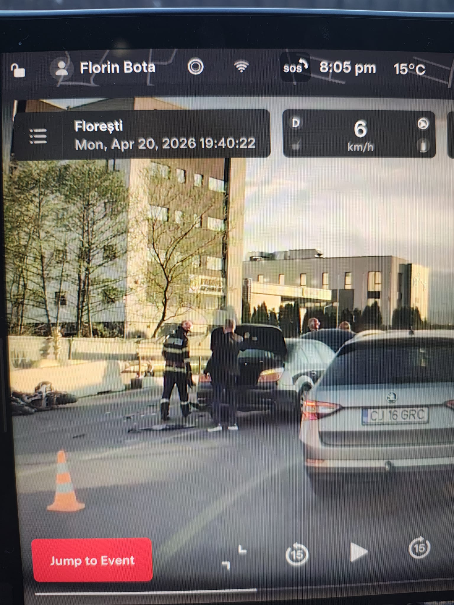

## Ce s-a intamplat?

Mai devreme, un accident s-a petrecut pe Strada Avram Iancu, pe DN1, aproape de intersectia cu Strada Valea Garbaului. Am vazut un BMW de un model mai vechi si o motocicleta alba accidentata intr-o bariera de ciment.

## Blocaj pe drum!

Traficul este temporar avariat pe sensul catre Centru. Ambele benzi sunt blocate de catre Pompieri, SMURD si Politie.

Am pus si o imagine mai jos:

## Presupuneri

Presupunem ca soferul BMW-ului nu s-a uitat in oglinzi cand a schimbat banda sau a intrat in sensul invers (deoarece in imagine asa este pozitionata masina) si motociclistul a intrat in masina, mergand printre benzi.

## Ce s-a intamplat cu motociclistul?

Conform [Stiri de Cluj](https://www.stiridecluj.ro/social/accident-la-iesirea-din-cluj-napoca-spre-floresti-un-motociclist-a-fost-ranit-primeste-ingrijiri-medicale-chiar-acum), motociclistul este doar ranit, constient si cooperant, si primeste ingrijiri medicale.